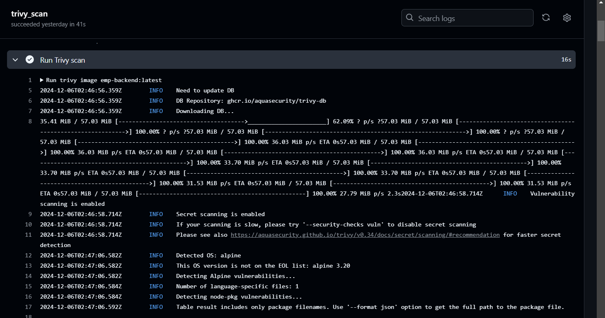

# Employee Management System 

## Project Overview
The Employee Management System is a web application built using the MERN stack (MongoDB, Express, React, Node.js) to manage employee data in an organization. This system enables administrators to add, view, edit, and delete employee records. Docker is used to containerize the backend and frontend, ensuring the application runs consistently across different environments.

## Features
- **User Authentication:** Admin and employee login.
- **Employee Management:** Add, edit, and delete employee records.
- **Department and Role Management:** Manage employee departments and roles.
- **Search and Filter:** Search employees by various criteria.
- **Responsive UI:** Built using React for a dynamic user interface.

## Live Demo
You can try the live version of this project by visiting the following link: [Live Demo](#)


## Technologies Used
- **MongoDB:** NoSQL database to store employee information.
- **Express.js:** Web framework for the backend API.
- **React:** Frontend library for a dynamic user interface.
- **Node.js:** JavaScript runtime for the backend.
- **Docker:** Containerization for consistent deployment across environments.
- **Nginx:** Web server to serve the React app in production.

## Project Images



## Setup Guide

### Step 1: Clone the Repository from GitHub
Clone the repository:

Open your terminal (or Git Bash if you're on Windows) and navigate to the directory where you want to store your project. Then, run the following command to clone your repository:

```bash
git clone https://github.com/your-username/employee-mgmt-dockerized.git
```
Replace `your-username` with your GitHub username and `employee-mgmt-dockerized` with the name of your repository.

Navigate to the project directory:

After cloning, move into the project directory:

```bash
cd employee-mgmt-dockerized
```

### Step 2: Install Dependencies for the Backend
Navigate to the backend directory (assuming your backend is in a folder called `backend`):

```bash
cd backend
```

Install the backend dependencies:

If you're using npm for backend dependencies, run:

```bash
npm install
```

This will install all the required dependencies specified in the `package.json` file.

### Step 3: Install Dependencies for the Frontend
Navigate to the frontend directory (assuming your frontend is in a folder called `frontend`):

```bash
cd ../frontend
```

Install the frontend dependencies:

If you're using npm for frontend dependencies, run:

```bash
npm install
```

### Step 4: Run the Backend Locally
Navigate back to the backend directory:

```bash
cd ../backend
```

Start the backend server:

If you're using npm, run:

```bash
node server.js
```

This will start the backend server. By default, the backend may run on port 5050. You can confirm this in your `server.js` file.

Verify: The backend should now be accessible at [http://localhost:5050](http://localhost:5050).

### Step 5: Run the Frontend Locally
Navigate back to the frontend directory:

```bash
cd ../frontend
```

Start the frontend server:

If you're using npm, run:

```bash
npm run dev
```

This will start the frontend server, which by default will run on port 3000.

Verify: The frontend should now be accessible at [http://localhost:3000](http://localhost:3000).

### Step 6: Dockerize the Backend (Only Backend)
To Dockerize the backend, you'll create a Dockerfile in your backend directory.

#### Step-by-Step:
1. Navigate to your backend folder.
2. Create a Dockerfile in the backend directory:

```dockerfile
FROM node:16

WORKDIR /app

COPY package*.json ./

RUN npm install

COPY . .

EXPOSE 5050

CMD ["node", "server.js"]
```

3. Build the Docker image:
Run the following command in the terminal (from the backend directory):

```bash
docker build -t my-backend .
```

4. Run the Docker container:
After building the image, run the backend container:

```bash
docker run -p 5050:5050 my-backend
```

This will run your backend on port 5050.

### Step 7: Multi-stage Build for Backend (Optional)
A multi-stage build allows you to create smaller images by having multiple stages in your Dockerfile.

#### Step-by-Step:
1. Modify your Dockerfile to use multi-stage builds:

```dockerfile
# Stage 1: Build
FROM node:18-alpine AS build
WORKDIR /app
COPY package*.json ./
RUN npm install
COPY . .

# Stage 2: Production
FROM node:18-alpine
WORKDIR /app
COPY --from=build /app /app
ENV NODE_ENV=production
EXPOSE 5050
CMD ["node", "server.js"]
```

2. Build the Docker image with multi-stage:

```bash
docker build -t my-backend-multistage .
```

3. Run the container:

```bash
docker run -p 5050:5050 my-backend-multistage
```

### Step 8: Push Image to Docker Hub (Only Backend)
To push the image to Docker Hub, follow these steps:

1. Log in to Docker Hub in your terminal:

```bash
docker login
```

2. Tag your image for Docker Hub:
Assuming your Docker Hub username is `username` and the image name is `my-backend`:

```bash
docker tag my-backend username/my-backend:latest
```

3. Push the image:
Push the tagged image to Docker Hub:

```bash
docker push username/my-backend:latest
```

### Step 9: Pull the NGINX Image from Docker Hub
To serve the React app, pull the latest official NGINX image from Docker Hub:

```bash
docker pull nginx:latest
```

### Step 10: Build the React Frontend (if not already built)
If you haven't already built the React app, navigate to the frontend directory and build the React app:

```bash
cd path/to/your/frontend
npm run build
```

This will create a `build/` directory in your frontend project that contains all the static files.

### Step 11: Volume Map React Build Files to NGINX
Now, we’ll run the NGINX container and map the volume to serve the React app's static files.

Run the NGINX container and map volumes:

```bash
docker run -d -p 3002:80 \
    -v ./employee-mgmt-dockerized/frontend/public/build:/usr/share/nginx/html \
    -v ./employee-mgmt-dockerized/frontend/nginx/nginx.conf:/etc/nginx/nginx.conf \
    nginx
```

Verify that the NGINX container is running by visiting [http://localhost](http://localhost) in your browser. Your React app should now be served by NGINX.

### Step 12: Optional - Run Both Backend and Frontend with Docker Compose
If you want to run both the backend (Node.js) and frontend (NGINX) using Docker Compose, you can create a `docker-compose.yml` file to manage both services.

Create a `docker-compose.yml` file in your project root directory with the following content:

```yaml
version: '3'

services:
    backend:
        image: emp-backend
        build: ./backend
        ports:
            - "5050:5050"

    frontend:
        image: nginx
        volumes:
            - ./frontend/build:/usr/share/nginx/html
            - ./frontend/nginx/nginx.conf:/etc/nginx/nginx.conf
        ports:
            - "3000:80"
```

#### Step-by-Step:
1. Navigate to the project’s root directory.
2. Run the Docker Compose services:

```bash
docker-compose up --build
```

This will start both the backend and the frontend in their respective containers. Your backend will be available at [http://localhost:5050](http://localhost:5050), and your frontend will be available at [http://localhost:3000](http://localhost:3000).